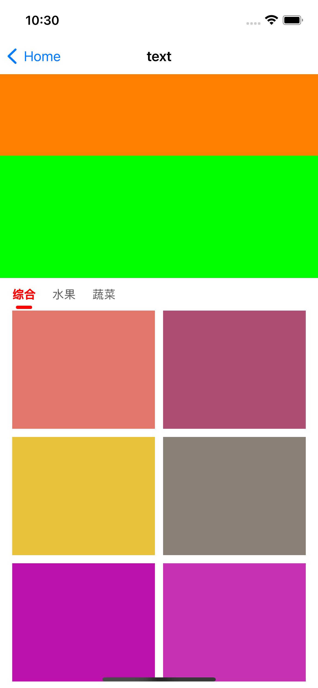

# 动态锁住子scrollView的滚动


#### 一、初始化

0、创建主的scrollView，命名为mainScrollView
1、给mainScrollView添加top\left\right\bottom添加约束，
2、mainScrollView里添加contentView，contentView的top\left\right是到super，给view添加bottom添加contentView的最后面一个子view的bottom
3、在`viewDidLayoutSubviews`里获取contentView的size，同时设置给scrollView的contentSize

```
override func viewDidLayoutSubviews() {
        super.viewDidLayoutSubviews()
        self.mainScrollView.contentSize = self.contentView.size
    }
```
在contentView的高度有变化时，调用
```
self.contentView.superView.layoutIfNeeded()
self.mainScrollView.contentSize = self.contentView.size
```
#### 二、滚动控制
##### 2.1 在主滚动区滚动后判定竖直子滚动区是否可以滚动
对主mainScrollView的滚动进行判定
```
extension LockVerMainScrollController: UIScrollViewDelegate {
    func scrollViewDidScroll(_ scrollView: UIScrollView) {
            let offsetY = mainScrollView.contentOffset.y
            // 底部悬浮部分的容器内容一般高度是固定的
            let topHeight = mainScrollView.contentSize.height - bottomHeight
            if offsetY >= topHeight {
              // 顶部已经滚动到不可见了，该到底部内容滚动的了
                if offsetY > topHeight {
                    mainScrollView.contentOffset.y = topHeight
                }
                currentSubVC()?.collectionView.isScrollEnabled = true
            }
        }
        
        func scrollViewDidEndDragging(_ scrollView: UIScrollView, willDecelerate decelerate: Bool) {
            let offsetY = mainScrollView.contentOffset.y
            let topHeight = mainScrollView.contentSize.height - bottomHeight
            if offsetY < topHeight {
                // 顶部还有部分可见，底部内容不能滚动
                currentSubVC()?.collectionView.isScrollEnabled = false
                currentSubVC()?.collectionView.contentOffset.y = 0
            }
        }
        
        func scrollViewDidEndDecelerating(_ scrollView: UIScrollView) {
            let offsetY = mainScrollView.contentOffset.y
            let topHeight = mainScrollView.contentSize.height - bottomHeight
            if offsetY < topHeight {
                // 顶部还有部分可见，底部内容不能滚动
                currentSubVC()?.collectionView.isScrollEnabled = false
                currentSubVC()?.collectionView.contentOffset.y = 0
            }
        }
}
```
##### 2.2 在水平滚动区切换后，判定竖直滚动区是否可以滚动
```
extension LockVerMainScrollController: JXCategoryViewDelegate {
    public func categoryView(_ categoryView: JXCategoryBaseView!, didSelectedItemAt index: Int) {
        let offsetY = mainScrollView.contentOffset.y
        let topHeight = mainScrollView.contentSize.height - bottomHeight
        if offsetY < topHeight {
            // 顶部还有部分可见，底部内容不能滚动
            currentSubVC()?.collectionView.isScrollEnabled = false
        }else {
            // 主scrollVie已经到了悬浮位置
            currentSubVC()?.collectionView.isScrollEnabled = true
        }
    }
}
```

##### 2.3 字滚动区域滚动后
```
extension LockVerSubScrollController: UIScrollViewDelegate {
    func scrollViewDidScroll(_ scrollView: UIScrollView) {
        let offsetY = scrollView.contentOffset.y
        if offsetY <= 0 {
            // 往下拉，且顶部内容已经全部看见的情况，用于触发主scrollVew往下拉，且锁住子scrollView不能滑动
            if let callback = mainScrollCallback {
                scrollView.contentOffset.y = 0
                scrollView.isScrollEnabled = false
                callback(scrollView)
            }
        }
    }
    
    func scrollViewDidEndDragging(_ scrollView: UIScrollView, willDecelerate decelerate: Bool) {
        let offsetY = scrollView.contentOffset.y
        if offsetY < 0 {
            // 往下拉，且顶部内容已经全部看见的情况，用于触发主scrollVew往下拉，且锁住子scrollView不能滑动
            
            if let callback = mainScrollCallback {
                scrollView.contentOffset.y = 0
                scrollView.isScrollEnabled = false
                callback(scrollView)
            }
            
        }
    }
    
    func scrollViewDidEndDecelerating(_ scrollView: UIScrollView) {
        let offsetY = scrollView.contentOffset.y
        if offsetY < 0 {
            // 往下拉，且顶部内容已经全部看见的情况，用于触发主scrollVew往下拉，且锁住子scrollView不能滑动
            if let callback = mainScrollCallback {
                scrollView.contentOffset.y = 0
                scrollView.isScrollEnabled = false
                callback(scrollView)
            }
        }
    }
}
```



